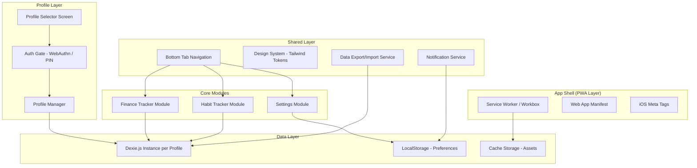

# Design Document: Life Dashboard PWA

## Overview

Life Dashboard PWA is a client-side Progressive Web Application targeting iOS Safari home screen installation. It provides two core modules — Finance Tracker (monthly budgeting/expenses) and Habit Tracker (daily discipline checklist with streaks) — with multi-user profile support, biometric authentication, and full offline capability.

The application is built with React + TypeScript + Vite, styled with Tailwind CSS using iOS-inspired design tokens, and persists all data locally using Dexie.js (IndexedDB wrapper). It deploys as static assets to any CDN (Netlify/Vercel/GitHub Pages) with zero backend dependencies.

### Key Design Decisions

| Decision | Rationale |
|----------|-----------|
| Dexie.js over raw IndexedDB | Simpler API, built-in versioning/migrations, reactive queries via `liveQuery` |
| React Context + useReducer over Redux | Lightweight for a single-device app; no need for middleware or devtools overhead |
| Per-profile Dexie instances | True data isolation without query-level filtering; prevents cross-profile leakage |
| vite-plugin-pwa (Workbox) | Generates service worker with precaching + runtime caching strategies automatically |
| WebAuthn API | Native biometric prompts on iOS; graceful fallback to PIN on unsupported hardware |
| Chart.js | Small bundle, canvas-based (performant on mobile), supports the chart types needed |
| @dnd-kit | Accessible drag-and-drop with touch support, tree-sortable for habit reordering |
| Tailwind CSS | Utility-first approach maps well to iOS design tokens; supports dark mode via `class` strategy |

## Architecture



### Architectural Layers

1. **App Shell (PWA)** — Service worker registration, manifest, iOS-specific meta tags, offline caching strategy (precache app shell, stale-while-revalidate for icons/fonts).

2. **Profile Layer** — Profile selection screen, WebAuthn/PIN authentication gate, profile CRUD operations. Controls which Dexie database instance is active.

3. **Core Modules** — Finance Tracker (income, categories, expenses, dashboard, weekly stats), Habit Tracker (daily checklist, habit/category/group management, streaks, weekly stats), Settings (notifications, export/import, auth config, theme).

4. **Shared Layer** — Bottom tab navigation, design system tokens, notification scheduling service, data export/import utilities.

5. **Data Layer** — Dexie.js with one database per profile (`life_dash_profile_{id}`), LocalStorage for cross-profile preferences and lockout state, Cache Storage managed by service worker.

### Routing Structure

```
/                       → Redirect to /profiles or /finance (if authenticated)
/profiles               → Profile selection / creation
/profiles/auth/:id      → Authentication gate for a profile
/finance                → Finance Dashboard (charts + summary)
/finance/income         → Income management
/finance/categories     → Category management
/finance/expenses       → Expense list and entry
/finance/weekly         → Weekly statistics
/habits                 → Daily habit checklist
/habits/manage          → Habit/Category/Group CRUD
/habits/stats           → Weekly habit statistics
/settings               → Settings (notifications, export/import, auth, about)
```

## Components and Interfaces

### Profile Layer Components

```typescript
// ProfileSelector.tsx — Grid of profile cards + "Add Profile" button
// ProfileCreator.tsx — Form: name input, optional biometric enrollment
// AuthGate.tsx — WebAuthn prompt / PIN input / lockout countdown
// ProfileContext.tsx — Provides active profile ID + Dexie instance
```

### Finance Module Components

```typescript
// FinanceDashboard.tsx — Chart.js pie/bar charts + budget progress bars
// IncomeList.tsx — List of income entries for selected month
// IncomeForm.tsx — Add/edit income entry (amount, source, month)
// CategoryList.tsx — Alphabetical list of expense categories
// CategoryForm.tsx — Add/edit category (name, budget limit)
// ExpenseList.tsx — Filterable list of expenses for selected month
// ExpenseForm.tsx — Add/edit expense (amount, category, date, notes)
// WeeklyStats.tsx — Weekly spending breakdown with budget comparison
// MonthSelector.tsx — Shared month navigation component
```

### Habit Module Components

```typescript
// DailyChecklist.tsx — Grouped habit list with tap-to-cycle status
// HabitItem.tsx — Single habit row: status indicator, name, streak badge
// HabitForm.tsx — Add/edit habit (name, category assignment)
// CategoryManager.tsx — CRUD for habit categories
// GroupManager.tsx — CRUD for habit groups
// StreakDisplay.tsx — Current + longest streak with milestone celebration
// WeeklyHabitStats.tsx — 7-day grid + completion percentages
// DragSortableList.tsx — @dnd-kit wrapper for reorderable lists
```

### Shared Components

```typescript
// BottomTabBar.tsx — 3 tabs: Finance, Habits, Settings
// ConfirmDialog.tsx — Reusable confirmation modal (iOS action sheet style)
// ValidationError.tsx — Inline form validation message
// EmptyState.tsx — Centered illustration + message for empty lists
// Toast.tsx — Transient notification for success/error feedback
// NotificationBanner.tsx — Dismissible banner for notification permission
```

### Key Interfaces / Services

```typescript
// services/auth.service.ts
interface AuthService {
  isWebAuthnSupported(): Promise<boolean>;
  enrollBiometric(profileId: string): Promise<boolean>;
  authenticateBiometric(profileId: string): Promise<boolean>;
  verifyPin(profileId: string, pin: string): boolean;
  setPin(profileId: string, pin: string): void;
  getLockoutState(profileId: string): LockoutState;
  recordFailedAttempt(profileId: string): LockoutState;
  resetAttempts(profileId: string): void;
}

// services/notification.service.ts
interface NotificationService {
  requestPermission(): Promise<NotificationPermission>;
  scheduleHabitReminder(time: string, period: 'morning' | 'evening'): void;
  scheduleFinanceReminder(time: string): void;
  cancelAll(): void;
  getPermissionStatus(): NotificationPermission;
}

// services/export.service.ts
interface ExportService {
  exportProfile(profileId: string): Promise<Blob>;
  validateImportFile(file: File): Promise<ValidationResult>;
  importProfile(profileId: string, data: ExportData): Promise<void>;
}

// services/db.service.ts
interface DbService {
  getProfileDb(profileId: string): Dexie;
  deleteProfileDb(profileId: string): Promise<void>;
  checkStorageQuota(): Promise<StorageEstimate>;
}
```

### State Management

```typescript
// context/AppContext.tsx
interface AppState {
  activeProfileId: string | null;
  isAuthenticated: boolean;
  currentModule: 'finance' | 'habits' | 'settings';
  theme: 'light' | 'dark' | 'system';
}

// context/FinanceContext.tsx
interface FinanceState {
  selectedMonth: { year: number; month: number };
  incomeEntries: IncomeEntry[];
  categories: ExpenseCategory[];
  expenses: Expense[];
  draftExpense: Partial<Expense> | null;
  draftIncome: Partial<IncomeEntry> | null;
}

// context/HabitContext.tsx
interface HabitState {
  today: string; // ISO date
  groups: HabitGroup[];
  categories: HabitCategory[];
  habits: Habit[];
  dailyStatuses: Map<string, HabitStatus>; // habitId -> status
  collapsedGroups: Set<string>;
  collapsedCategories: Set<string>;
}
```

## Data Models

### Profile Database Schema (per-profile Dexie instance)

```typescript
// db/schema.ts
import Dexie, { Table } from 'dexie';

export interface IncomeEntry {
  id?: string;          // Auto-generated UUID
  amount: number;       // 0.01 – 999,999,999.99
  source: string;       // 1–100 characters
  month: string;        // "YYYY-MM" format
  createdAt: number;    // Unix timestamp
  updatedAt: number;
}

export interface ExpenseCategory {
  id?: string;
  name: string;         // 1–50 characters, unique (case-insensitive)
  budgetLimit: number;  // 0.01 – 999,999,999.99
  createdAt: number;
  updatedAt: number;
}

export interface Expense {
  id?: string;
  amount: number;       // 0.01 – 9,999,999.99
  categoryId: string;   // FK → ExpenseCategory.id
  date: string;         // "YYYY-MM-DD" format
  notes: string;        // 0–200 characters
  month: string;        // "YYYY-MM" derived from date, indexed for queries
  createdAt: number;
  updatedAt: number;
}

export interface HabitGroup {
  id?: string;
  name: string;         // 1–50 characters, unique within profile
  order: number;        // Sort order
  createdAt: number;
  updatedAt: number;
}

export interface HabitCategory {
  id?: string;
  name: string;         // 1–50 characters, unique within group
  groupId: string;      // FK → HabitGroup.id
  order: number;        // Sort order within group
  createdAt: number;
  updatedAt: number;
}

export interface Habit {
  id?: string;
  name: string;         // 1–100 characters
  categoryId: string;   // FK → HabitCategory.id
  order: number;        // Sort order within category
  isActive: boolean;    // Soft-delete: false hides from checklist
  createdAt: number;
  updatedAt: number;
}

export interface HabitCompletion {
  id?: string;
  habitId: string;      // FK → Habit.id
  date: string;         // "YYYY-MM-DD"
  status: 'not_started' | 'in_progress' | 'completed';
  updatedAt: number;
}

export interface StreakRecord {
  id?: string;
  habitId: string;      // FK → Habit.id
  currentStreak: number;
  longestStreak: number;
  lastCompletedDate: string | null; // "YYYY-MM-DD" or null
  updatedAt: number;
}

// Dexie Database Class
export class ProfileDatabase extends Dexie {
  incomeEntries!: Table<IncomeEntry>;
  expenseCategories!: Table<ExpenseCategory>;
  expenses!: Table<Expense>;
  habitGroups!: Table<HabitGroup>;
  habitCategories!: Table<HabitCategory>;
  habits!: Table<Habit>;
  habitCompletions!: Table<HabitCompletion>;
  streakRecords!: Table<StreakRecord>;

  constructor(profileId: string) {
    super(`life_dash_profile_${profileId}`);
    this.version(1).stores({
      incomeEntries: '++id, month, createdAt',
      expenseCategories: '++id, &name, createdAt',
      expenses: '++id, categoryId, month, date',
      habitGroups: '++id, &name, order',
      habitCategories: '++id, groupId, order',
      habits: '++id, categoryId, order, isActive',
      habitCompletions: '++id, habitId, date, [habitId+date]',
      streakRecords: '++id, &habitId',
    });
  }
}
```

### Global Storage (LocalStorage)

```typescript
// localStorage keys (prefixed with profile ID where applicable)
interface GlobalPreferences {
  'profiles': ProfileMeta[];                    // Array of {id, name, hasAuth, createdAt}
  'active_profile': string | null;              // Last used profile ID
  'lockout_{profileId}': LockoutState;          // {failedAttempts, lockedUntil}
  'pin_{profileId}': string;                    // Hashed PIN (SHA-256)
  'settings_{profileId}': UserSettings;         // Notification prefs, theme override
  'webauthn_credential_{profileId}': string;    // Stored credential ID for WebAuthn
}

interface ProfileMeta {
  id: string;
  name: string;
  hasAuth: boolean;
  authType: 'biometric' | 'pin' | null;
  createdAt: number;
}

interface LockoutState {
  failedAttempts: number;
  lockedUntil: number | null;  // Unix timestamp or null
}

interface UserSettings {
  habitReminderMorning: string | null;   // "HH:MM" or null
  habitReminderEvening: string | null;
  financeReminder: string | null;
  notificationsEnabled: boolean;
  theme: 'light' | 'dark' | 'system';
}
```

### Data Export Format

```typescript
interface ExportData {
  version: 1;
  exportedAt: string;           // ISO datetime
  profileName: string;
  finance: {
    incomeEntries: IncomeEntry[];
    expenseCategories: ExpenseCategory[];
    expenses: Expense[];
  };
  habits: {
    habitGroups: HabitGroup[];
    habitCategories: HabitCategory[];
    habits: Habit[];
    habitCompletions: HabitCompletion[];
    streakRecords: StreakRecord[];
  };
}
```

## Correctness Properties

*A property is a characteristic or behavior that should hold true across all valid executions of a system — essentially, a formal statement about what the system should do. Properties serve as the bridge between human-readable specifications and machine-verifiable correctness guarantees.*

### Property 1: Profile name validation

*For any* string input, profile creation SHALL succeed if and only if the string length is between 1 and 30 characters (inclusive) and no existing profile has the same name (case-insensitive comparison).

**Validates: Requirements 2.4, 2.5**

### Property 2: Profile data isolation

*For any* two distinct profile IDs and any data written to one profile's Dexie database instance, querying the other profile's database instance SHALL return zero matching records.

**Validates: Requirements 2.3**

### Property 3: Authentication lockout state machine

*For any* sequence of N consecutive failed authentication attempts (biometric or PIN) against a profile, the profile SHALL be locked if and only if N >= 3, and the lockout SHALL persist for exactly 30 seconds. The failed attempt counter and lockout state SHALL persist across app reloads.

**Validates: Requirements 3.3, 3.5**

### Property 4: PIN format validation

*For any* string input, PIN validation SHALL accept the input if and only if it consists exclusively of numeric digits and has a length between 4 and 6 characters (inclusive).

**Validates: Requirements 3.5**

### Property 5: Income entry validation

*For any* amount and source string, income entry creation SHALL succeed if and only if the amount is between 0.01 and 999,999,999.99 (inclusive) and the source string length is between 1 and 100 characters (inclusive).

**Validates: Requirements 5.1, 5.6, 5.7**

### Property 6: Income monthly total

*For any* set of income entries associated with a given month, the displayed monthly total SHALL equal the arithmetic sum of all entry amounts for that month.

**Validates: Requirements 5.2**

### Property 7: Month navigation range

*For any* target month, navigation SHALL be allowed if and only if the target month is any past month or up to 12 months in the future relative to the current month.

**Validates: Requirements 5.5**

### Property 8: Expense category validation

*For any* category name and budget limit, category creation SHALL succeed if and only if the name length is between 1 and 50 characters, no existing category has the same name (case-insensitive), and the budget limit is between 0.01 and 999,999,999.99.

**Validates: Requirements 6.1, 6.5, 6.6, 6.7**

### Property 9: Category deletion cascades to expenses

*For any* category with associated expenses, after the category is deleted, the expenses table SHALL contain zero entries referencing that category's ID.

**Validates: Requirements 6.3**

### Property 10: Category alphabetical ordering

*For any* set of expense categories, the displayed list SHALL be ordered alphabetically by name using case-insensitive comparison.

**Validates: Requirements 6.4**

### Property 11: Expense entry validation

*For any* expense data (amount, categoryId, date, notes), expense creation SHALL succeed if and only if amount is between 0.01 and 9,999,999.99, categoryId references an existing category, date falls within the selected month and is not in the future, and notes length is between 0 and 200 characters.

**Validates: Requirements 7.1, 7.3, 7.4, 7.5**

### Property 12: Dashboard spending per category

*For any* set of expenses in a month, the chart data for each category SHALL equal the sum of all expense amounts in that category for that month.

**Validates: Requirements 8.1**

### Property 13: Budget status and over-budget warning

*For any* category with budget limit B and total monthly spending S, the budget progress indicator SHALL show S/B as the proportion consumed, and the over-budget warning SHALL be displayed if and only if S > B.

**Validates: Requirements 8.2, 8.3**

### Property 14: Dashboard balance computation

*For any* month with income entries and expenses, the displayed remaining balance SHALL equal the sum of all income amounts minus the sum of all expense amounts for that month.

**Validates: Requirements 8.4**

### Property 15: Weekly spending partition invariant

*For any* month, the weekly partitions SHALL cover every day of the month exactly once, each full week SHALL start on Monday, and the sum of spending across all weeks SHALL equal the total monthly spending.

**Validates: Requirements 9.1**

### Property 16: Weekly proportional budget comparison

*For any* week within a month, the proportional weekly budget SHALL equal (sum of all category budget limits / number of days in the month) × number of days in that week, and the over-budget indicator SHALL appear if and only if actual weekly spending exceeds this proportional budget.

**Validates: Requirements 9.2, 9.3**

### Property 17: Weekly category percentage breakdown

*For any* week with total spending > 0, the sum of all category spending percentages SHALL equal 100 (within ±1 due to rounding), and each category's percentage SHALL equal (category weekly spending / total weekly spending) × 100.

**Validates: Requirements 9.4**

### Property 18: Habit status cycle

*For any* habit with current status S, a single tap SHALL advance the status to the next state in the cycle: not_started → in_progress → completed → not_started. Three consecutive taps SHALL return the status to S.

**Validates: Requirements 10.2, 10.3, 10.4**

### Property 19: Habit completion summary counts

*For any* set of daily habit statuses, the displayed summary counts SHALL equal the actual count of habits in each respective state (completed, in_progress, not_started), and the sum of all counts SHALL equal the total number of active habits.

**Validates: Requirements 10.8**

### Property 20: Habit name validation

*For any* string input, habit creation SHALL succeed if and only if the string length is between 1 and 100 characters (inclusive) and a valid category is assigned.

**Validates: Requirements 11.1, 11.2**

### Property 21: Habit deletion preserves history

*For any* habit with existing completion records and streak records, after the habit is deleted (deactivated), all historical completion records and streak records for that habit SHALL remain in the database.

**Validates: Requirements 11.4**

### Property 22: Structural operations preserve items

*For any* reorder or move operation on habits, categories, or groups, the total count of items SHALL remain unchanged and each item SHALL have a valid, unique order value within its container.

**Validates: Requirements 11.5, 12.6**

### Property 23: Habit category name validation

*For any* category name within a given habit group, category creation SHALL succeed if and only if the name length is between 1 and 50 characters and no other category in the same group has the same name.

**Validates: Requirements 12.1**

### Property 24: Habit group name validation

*For any* group name within a profile, group creation SHALL succeed if and only if the name length is between 1 and 50 characters and no other group in the profile has the same name.

**Validates: Requirements 12.2**

### Property 25: Hierarchy structural invariant

*For any* state of the habit data, every habit SHALL reference exactly one existing category, every category SHALL reference exactly one existing group, and no orphan references SHALL exist.

**Validates: Requirements 12.3, 12.9**

### Property 26: Streak calculation

*For any* habit and any sequence of daily completion statuses, the current streak SHALL equal the number of consecutive days with status "completed" counting backward from the most recent day (inclusive). Only "completed" status counts; "in_progress" and "not_started" break the streak.

**Validates: Requirements 13.1, 13.2, 13.3, 13.4, 13.8**

### Property 27: Longest streak calculation

*For any* habit's complete completion history, the longest streak SHALL equal the maximum length of any consecutive run of "completed" days within the entire history.

**Validates: Requirements 13.5**

### Property 28: Streak milestone detection

*For any* streak count N, a milestone celebration SHALL be triggered if and only if N is in the set {7, 14, 30, 60, 90, 365}.

**Validates: Requirements 13.6**

### Property 29: Per-habit weekly completion rate

*For any* habit over a 7-day period (or fewer days if the habit was created mid-week), the completion rate SHALL equal (number of days with status "completed" / number of active days for that habit in the period) × 100, rounded to the nearest whole number.

**Validates: Requirements 14.1, 14.6**

### Property 30: Overall weekly completion percentage

*For any* set of habits over a week, the overall completion percentage SHALL equal (total "completed" habit-days / total active habit-days across all habits) × 100, rounded to the nearest whole number.

**Validates: Requirements 14.2**

### Property 31: Top/bottom habit ranking

*For any* set of habits with computed weekly completion rates, the "top 3" SHALL be the 3 habits with the highest rates and the "bottom 3" SHALL be the 3 habits with the lowest rates. If fewer than 3 habits exist, all habits SHALL be shown in the respective group.

**Validates: Requirements 14.4**

### Property 32: Notification time validation

*For any* time input, the system SHALL accept it if and only if it is a valid HH:MM value in 15-minute increments (minutes divisible by 15), and falls within the allowed range for its type: morning habit (05:00–11:45), evening habit (17:00–23:45), or finance (00:00–23:45).

**Validates: Requirements 15.4**

### Property 33: Export-import round trip

*For any* profile with finance and habit data, exporting the profile to JSON and then importing that JSON into an empty profile SHALL produce a database state identical to the original (all records match in content and count).

**Validates: Requirements 18.1, 18.4**

### Property 34: Import file validation

*For any* file input, import validation SHALL pass if and only if the file contains valid JSON, has the expected structure (version field, finance section with incomeEntries/expenseCategories/expenses, habits section with habitGroups/habitCategories/habits/habitCompletions/streakRecords), and the file size does not exceed 50 MB.

**Validates: Requirements 18.3**

## Error Handling

### Storage Errors

| Error Scenario | Handling Strategy |
|---------------|-------------------|
| IndexedDB unavailable | Fall back to LocalStorage adapter; display persistent warning about 5MB limit |
| Storage quota exceeded | Display error toast; abort write; preserve existing data unchanged |
| DB corruption detected | Display error dialog; offer "Reset Profile" or "Export Recoverable Data" actions |
| Write failure on status toggle | Revert UI to previous state; show error toast |

### Authentication Errors

| Error Scenario | Handling Strategy |
|---------------|-------------------|
| WebAuthn not supported | Auto-fallback to PIN entry mode |
| Biometric enrollment fails | Show error; remain on auth settings screen with retry option |
| 3 consecutive auth failures | Lock profile for 30s; show countdown; persist lockout in LocalStorage |
| WebAuthn credential lost (user cleared browser data) | Detect missing credential; prompt re-enrollment or PIN setup |

### Data Validation Errors

| Error Scenario | Handling Strategy |
|---------------|-------------------|
| Invalid form input | Display inline validation error below the field; retain entered data; prevent submission |
| Duplicate category/profile name | Show specific "already exists" message |
| Import file invalid | Show error with specific reason (malformed JSON, missing sections, too large); preserve existing data |
| Import interrupted | Transaction rollback via Dexie transactions; restore pre-import state |

### Network and PWA Errors

| Error Scenario | Handling Strategy |
|---------------|-------------------|
| Service worker registration fails | Log error; continue in online-only mode; app remains functional |
| Notification permission denied | Show in-app banner once per session explaining how to enable in iOS Settings |
| Notification scheduling fails | Silent failure; log error; do not block user flow |

### General Error Boundary

A React error boundary at the module level catches unhandled errors. Behavior:
- Display a friendly error screen with "Something went wrong" message
- Offer "Reload Module" button that resets the module's state
- Log error details to console for debugging
- Never crash the entire app — other modules remain accessible via navigation

## Testing Strategy

### Testing Stack

| Layer | Tool | Purpose |
|-------|------|---------|
| Unit tests | Vitest | Pure functions, validation logic, computations |
| Property tests | fast-check + Vitest | Universal properties across generated inputs |
| Component tests | React Testing Library + Vitest | Component rendering and interaction |
| Integration tests | Vitest + fake-indexeddb | Data layer operations with mocked IndexedDB |
| E2E tests | Playwright (optional) | Critical user flows on iOS Safari |

### Property-Based Testing Configuration

- **Library**: fast-check (TypeScript-native, excellent integration with Vitest)
- **Minimum iterations**: 100 per property test
- **Tag format**: `// Feature: life-dashboard-pwa, Property {N}: {title}`
- Each correctness property maps to exactly one property-based test
- Generators produce random valid domain objects (profiles, income entries, expenses, habits, completion histories)

### Unit Test Focus Areas

- Form validation functions (income, expense, category, habit, profile, PIN)
- Streak calculation logic
- Weekly partitioning algorithm
- Budget computation (remaining budget, proportional weekly budget, percentages)
- Habit status cycle function
- Export/import serialization
- Month navigation bounds checking
- Notification time validation

### Integration Test Focus Areas

- Dexie CRUD operations per profile
- Profile data isolation (cross-profile queries)
- Cascade delete operations (category → expenses, group → categories → habits)
- Import transaction rollback on failure
- LocalStorage lockout state persistence

### Component Test Focus Areas

- Profile selector rendering with various profile counts
- Auth gate flow (biometric success, failure, lockout countdown)
- Form validation error display
- Habit status toggle interaction (tap cycling)
- Chart rendering with sample data
- Empty state displays
- Drag-and-drop reorder behavior

### Test File Organization

```
src/
├── __tests__/
│   ├── properties/           # Property-based tests (one file per domain)
│   │   ├── finance.property.test.ts
│   │   ├── habits.property.test.ts
│   │   ├── profiles.property.test.ts
│   │   ├── streaks.property.test.ts
│   │   └── export-import.property.test.ts
│   ├── unit/                 # Unit tests
│   │   ├── validators.test.ts
│   │   ├── streak-calculator.test.ts
│   │   ├── budget-calculator.test.ts
│   │   ├── week-partitioner.test.ts
│   │   └── notification-scheduler.test.ts
│   ├── integration/          # Integration tests
│   │   ├── db-operations.test.ts
│   │   ├── profile-isolation.test.ts
│   │   └── import-export.test.ts
│   └── components/           # Component tests
│       ├── ProfileSelector.test.tsx
│       ├── AuthGate.test.tsx
│       ├── HabitChecklist.test.tsx
│       └── FinanceDashboard.test.tsx
```

